  

    

  
  
  
  

> *Every worthwhile expedition begins with a single question. Mine has never changed —*
>
> ## *"How do you know your system actually works?"*

Beyond the safe, well-lit demos lies rougher country: where a beautiful backtest is a booby-trap, an agent's confident *"looks good to me"* is a mirage shimmering on the sand, and a forecast with no error bars is a treasure map drawn from rumor. I go there on purpose — build the machine, then try to break it. Preregistered claims, executable gates, adversarial review, and an honest logbook of every run that didn't make it back.

*Torches up. Here's what the expeditions have brought home.*

- **The Validation Crisis in AGI Capability Forecasting** — I carried quant finance's hardest-won tools (deflated Sharpe ratio, probability of backtest overfitting, walk-forward) into the temple of AGI timeline forecasting, and came back with the *Deflated Capability Forecast*. &nbsp;[read →](https://kacpersaks.dev/research/validation-crisis) &nbsp;·&nbsp; [web edition →](https://validationcrisis.vercel.app)
- **An Executable-Gate Multi-Agent Research Organization** — a 39-role expedition party where no member's word is trusted on faith; every finding must clear a gate before it counts. Shipped with a pre-registered study that *tests* the rules instead of assuming them. &nbsp;[Zenodo · DOI →](https://doi.org/10.5281/zenodo.20645678)

- **[worldclass-research-org](https://github.com/Ricko12vPL/worldclass-research-org)** — the research party above: 39 roles, executable gates, adversarial review, pre-registered calibration.
- **[QuantBrief](https://github.com/Ricko12vPL/QuantBrief)** — a 5-model Mistral pipeline that reads 256K-token SEC scrolls, listens for the market's rumors, and returns with spoken briefings in five tongues. *Mistral AI Hackathon 2026.*
- **[neo-triage-hack](https://github.com/Ricko12vPL/neo-triage-hack)** — because some treasure falls from the sky: Bayesian triage of Near-Earth Objects with Claude Opus, cross-checked against JPL Sentry-II and ESA NEOCC. *Anthropic × Cerebral Valley.* &nbsp;[live →](https://neo-triage-hack.vercel.app)
- **[claude-code-skills](https://github.com/Ricko12vPL/claude-code-skills)** — the toolbelt: Claude Code skills for Python, software engineering, ML, and quantitative finance.
- **X_Quant** — a lone crew sailing live markets: 20 AI agents, an Investment Council, and real IBKR execution. &nbsp;[overview →](https://kacpersaks.dev/projects/x-quant)

More from the vault — an ESG compliance agent, a document analyzer, and Kelly-criterion prediction-market sizing — at <a href="https://kacpersaks.dev/projects">kacpersaks.dev/projects</a>.

 &nbsp; &nbsp; &nbsp; &nbsp; &nbsp;

 &nbsp; &nbsp; &nbsp; &nbsp;

> *Executable gates over vibes · preregister before the result is known · the artifact is the deliverable · report the failures out loud.*

**In a hurry?** Three relics tell the whole story — the [Validation Crisis methodology](https://kacpersaks.dev/research/validation-crisis), [the research org that enforces it](https://github.com/Ricko12vPL/worldclass-research-org), and [X_Quant sailing live markets](https://kacpersaks.dev/projects/x-quant). CV & references on request.

[kacpersaks.dev](https://kacpersaks.dev) &nbsp;·&nbsp; [LinkedIn](https://linkedin.com/in/kacpersakspe) &nbsp;·&nbsp; [LeetCode](https://leetcode.com/u/ricko12vpl) &nbsp;·&nbsp; [kacpersaks@proton.me](mailto:kacpersaks@proton.me)

 

